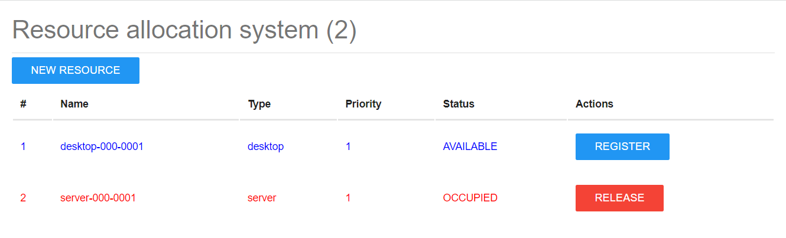
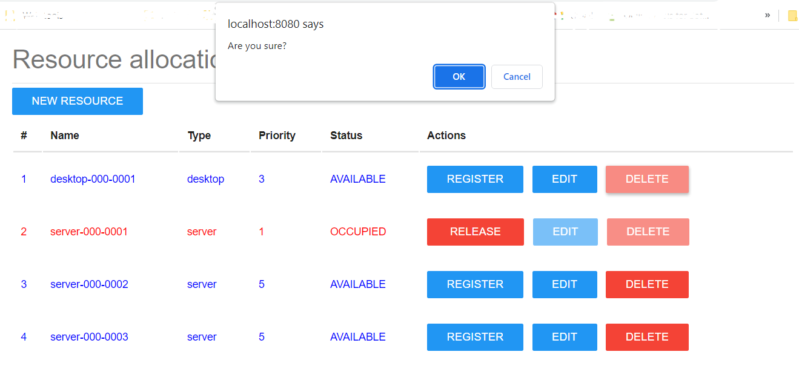
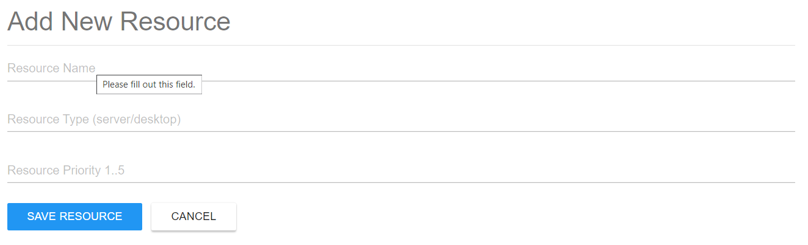
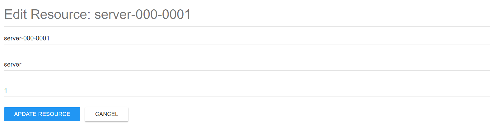

# Resource Allocation System

### Main Page:

<br /><br />

### Delete Resource:

<br /><br />

### Add New Resource:

<br /><br />

### Edit Resource:

<br /><br />

## Setup

To run this app locally (windows):

* Create a virtual env and activate it:
  * python -m venv <ABSOLUTE PATH>\venv
  * <ABSOLUTE PATH>\venv\Scripts\activate
  * pip install -r requirements.txt
  
* Run the app:
  * (venv) $ python app.py
  ```
  Bottle v0.12.19 server starting up (using WSGIRefServer())...
  Listening on http://localhost:8080/
  Hit Ctrl-C to quit.
  ```

* Build and run the app using Docker:
  * docker build . -t resource/allocation:v1.0
  * docker run -p 8080:80 -d resource/allocation:v1.0

 ## Bibliography
 * [Resource allocation systems](https://ifs.host.cs.st-andrews.ac.uk/Books/SE9/Web/Architecture/AppArch/ResAlloc.html)
 * [Resource Allocation System &#40;RAS&#41;](https://citizen-network.org/library/resource-allocation-system-ras.html)
 
